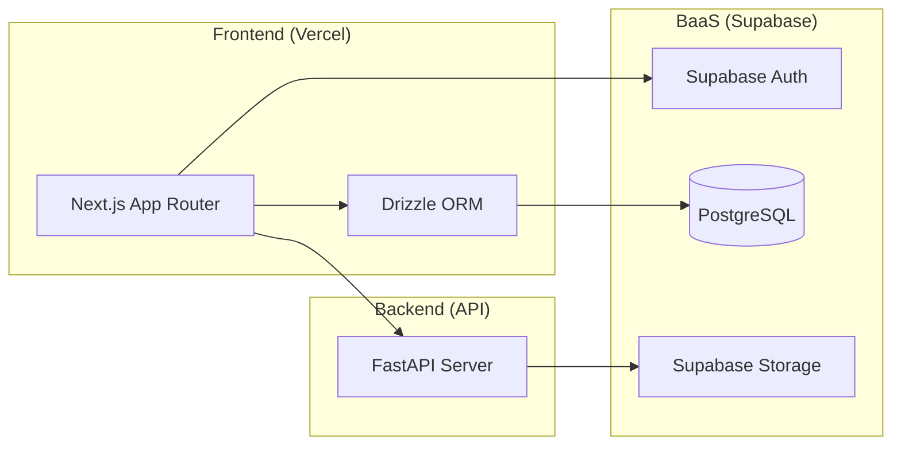

# Closetton (クローゼットン)

[](https://nextjs.org/)
[](https://fastapi.tiangolo.com/)
[](https://orm.drizzle.team/)
[](https://supabase.com/)

**子供の成長を記録し、家族で共有するモバイルファーストな在庫管理プラットフォーム**

## 🌟 プロジェクト概要

「せっかく買った服が、気づいたらサイズアウトしていた」「上の子の服がどこにあるか分からない」という育児の課題を解決するために開発されました。
**Closetton** は、単なるリスト管理ではなく、忙しい育児の合間に「片手で・直感的に」在庫を把握できる体験を提供します。

### 解決する課題

- **管理漏れの防止**: サイズ・季節・状態による強力なフィルタリング。
- **情報の非対称性の解消**: 家族間でのリアルタイムなデータ共有（実装予定）。
- **買い替えの最適化**: 在庫の可視化による、無駄な買い物の削減。

## 🏗 システムアーキテクチャ



## 🛠 技術スタック

### 技術選定の理由

- **Next.js (App Router) & TypeScript**: フロントエンドの型安全性を担保しつつ、Server Components を活用した高速なレンダリングを実現するため。
- **FastAPI (Python)**: 画像解析や将来的な機械学習（サイズ推論など）の導入を見据え、拡張性とパフォーマンスに優れた Python エコシステムを選択。
- **Drizzle ORM**: Prisma よりも軽量で SQL ライクな記述が可能であり、TypeScript との親和性が極めて高いため。
- **Supabase**: 認証・DB・ストレージを統合管理でき、開発速度とコスト効率を最大化するため。

## ✨ 主な機能と技術的ハイライト

### 1. モバイルファーストなUI/UX

- **Tailwind CSS** を活用したレスポンシブ設計。
- **Framer Motion**（または CSS Animation）による、カードタップ時のシームレスな拡大アニメーション。

### 2. 型安全なデータ駆動設計

- **Drizzle ORM** によるスキーマ定義により、データベースからフロントエンドまで一貫した型安全性を確保。
- **FastAPI × Pydantic** による、厳密なリクエストバリデーション。

### 3. クラウドストレージ連携

- **Supabase Storage** を利用した画像管理。
- `python-multipart` を用いた非同期的なバイナリデータ処理の最適化。

### 4. 高度なフィルタリング

- 状態（現役・保管・処分）やサイズに応じた動的なクエリ発行。

## 📂 プロジェクト構成

```text
├── frontend/      # Next.js (TypeScript, Drizzle ORM, Tailwind)
├── backend/       # FastAPI (Python 3.10+, Pydantic)
├── supabase/      # Migrations & Seed data (Optional)
├── .gitignore
└── README.md
```

## ⚙️ セットアップ

### 1. バックエンド (FastAPI)

```bash
cd backend
python -m venv venv
.\venv\Scripts\activate
pip install fastapi uvicorn supabase pydantic-settings python-multipart
uvicorn main:app --reload
```

※ `python-multipart` はフォームデータの処理（画像アップロード）に必須です。

### 2. フロントエンド (Next.js)

```bash
cd frontend
npm install
npm run dev
```
